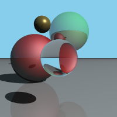

# Path tracer
## Made in Python, accelerated with Numba

### Installation
Install the [poetry](https://github.com/python-poetry/poetry) dependencies with:
```bash
$ cd raytracing
$ poetry install
```

Run the code with
```bash
$ cd pathtracer
$ poetry run jupyter notebook
```
### Preview

